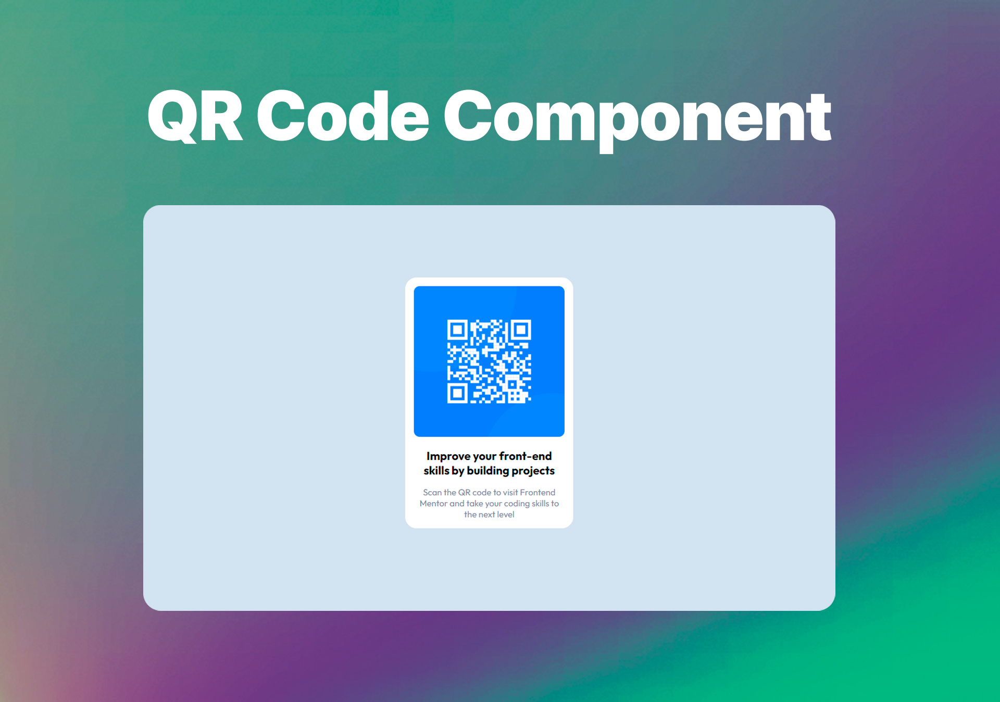

# Frontend Mentor - QR code component solution

This is a solution I developed to the [QR code component challenge on Frontend Mentor](https://www.frontendmentor.io/challenges/qr-code-component-iux_sIO_H). Frontend Mentor challenges help you improve your coding skills by building realistic projects.

## Table of contents

- [Overview](#overview)
  - [Screenshot](#screenshot)
  - [Links](#links)
- [My process](#my-process)
  - [Built with](#built-with)
  - [What I learned](#what-i-learned)
- [Author](#author)

## Overview

### Screenshot



### Links

- Solution URL: [QR Code Component](https://lealistic.github.io/qrcode-frontend-mentor)

## My process

### Built with

- CSS custom properties
- Flexbox
- CSS Grid

### What I learned

```css
#container {
  display: flex;
  justify-content: center;
  align-items: center;
  height: 100vh;
}
```

## Author

- LinkedIn - [Lucas Leal Martins](https://www.linkedin.com/in/lucaslealmartins/)
- Frontend Mentor - [@lealistic](https://www.frontendmentor.io/profile/lealistic)
